# 📘 Guida all'uso di GhostBat — Tutorial passo-passo

Questa guida descrive il flusso completo per utilizzare GhostBat come patcher selettivo per sistemi RetroBat, tramite CSV personalizzati e link diretti alle ROM.

---

## ⚠️ 1. Lettura del disclaimer iniziale

All'avvio di GhostBat viene mostrato un messaggio di disclaimer sul funzionamento reversibile del programma.  
L’utente deve cliccare **“Sì”** per procedere.

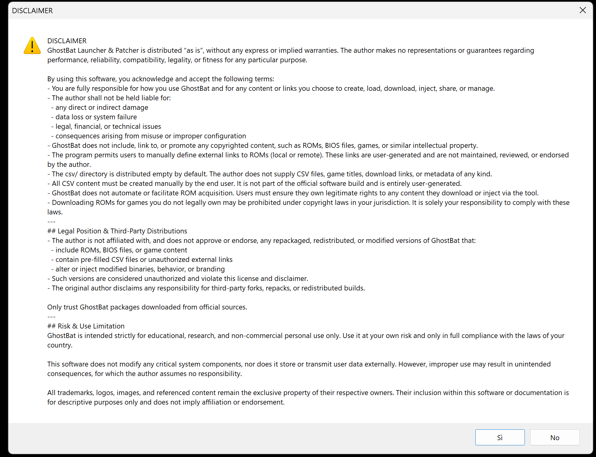

---

## 🔎 2. Verifica di RetroBat e richiesta applicazione mod

Dopo aver accettato il disclaimer, GhostBat controlla automaticamente se RetroBat è presente nella root del disco.

📌 Se il sistema è rilevato correttamente, appare un messaggio:

> ✅ RetroBat trovato! Vuoi applicare la mod?

Selezionando **“Sì”**, si conferma l’avvio del patcher.

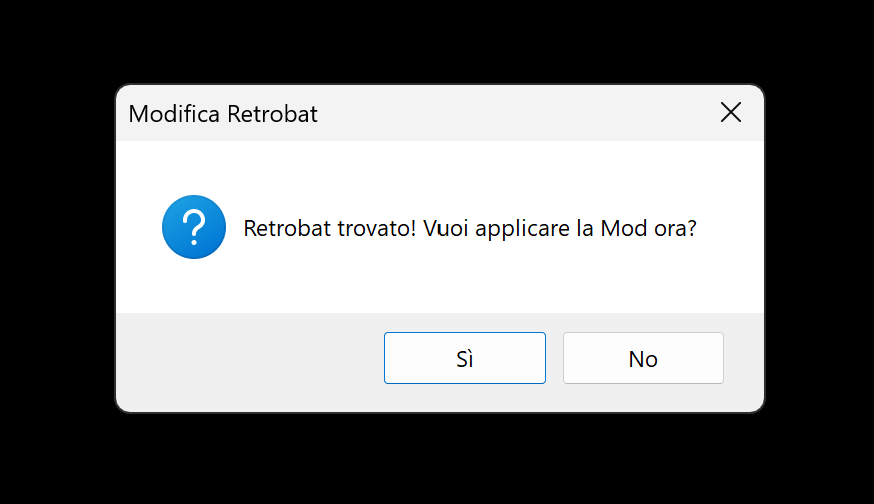

---

## ✅ 3. Conferma applicazione mod

GhostBat applica la mod necessaria e visualizza un messaggio:

> Mod installata correttamente! Ora puoi selezionare i sistemi compatibili.

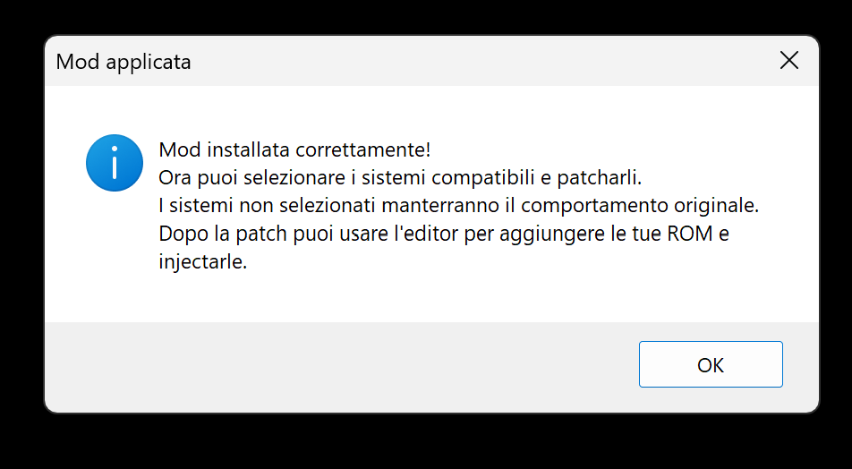

---

## 🧩 4. Apertura del patcher selettivo (mod)

Viene aperto il **patcher selettivo** contenuto nella cartella `mod`, che permette di:

- Visualizzare la lista dei sistemi RetroBat compatibili
- Selezionare singolarmente i sistemi da patchare

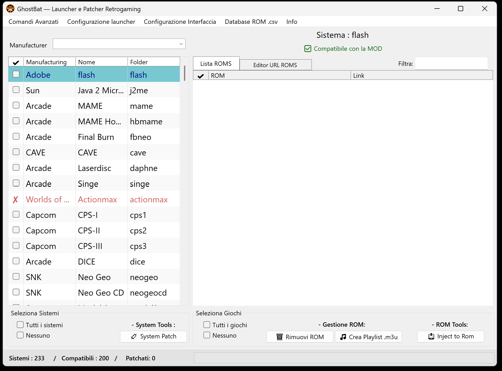

---

## 🛠️ 5. Selezione dei sistemi da patchare

✔️ Puoi:
- Spuntare solo i sistemi desiderati
- Oppure selezionarli tutti

Premi il pulsante **System Patch** per applicare la patch.

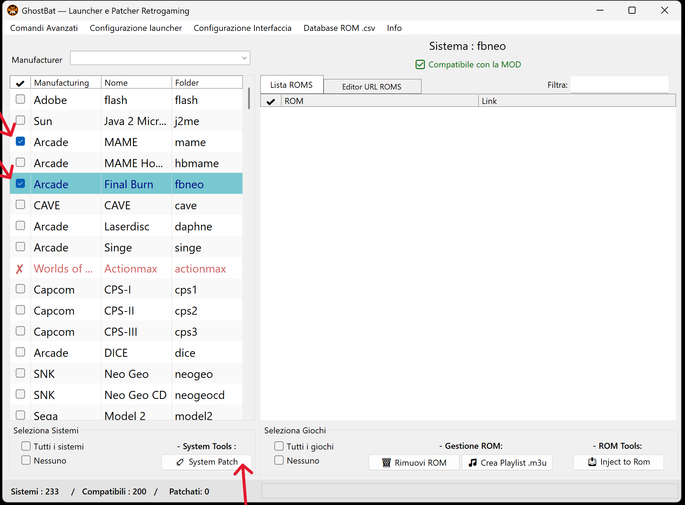

---

## 🍃 6. Identificazione dei sistemi patchati

I sistemi patchati correttamente vengono mostrati con **riga verde** nella lista laterale.  
Questa evidenza visiva conferma che sono attivi e pronti all’inserimento ROM.

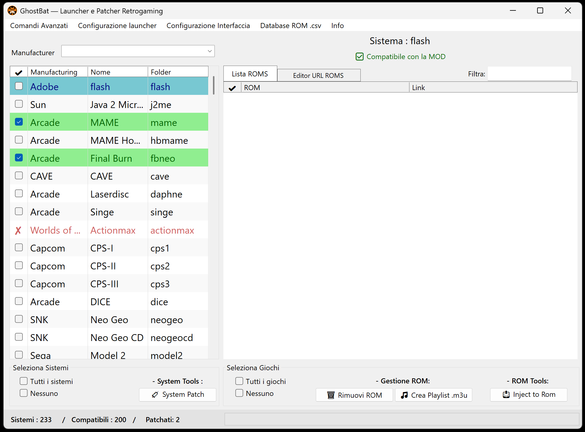

---

## 🌐 7. Apertura dell'Editor URL ROMS

Seleziona un sistema patchato e clicca su **Editor URL ROMS** per aprire la sezione dove puoi inserire link remoti alle ROM.

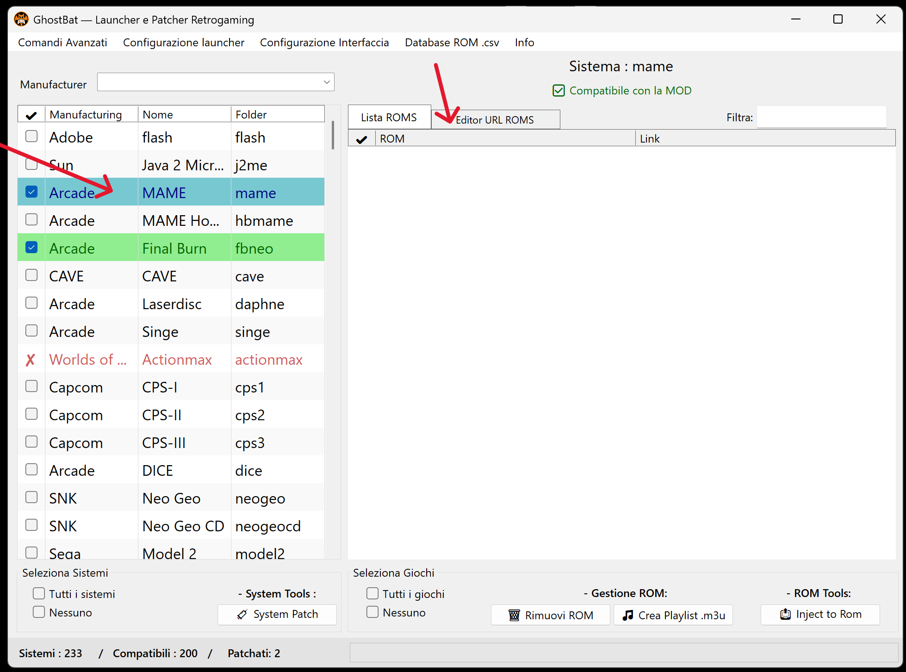

---

## 🌍 8. Inserimento link ROM e aggiunta al database CSV

Una volta aperto l’Editor URL ROMS, puoi iniziare a compilare manualmente la lista delle ROM da iniettare nel sistema selezionato.

📌 Inserisci:
- Il **nome del file ROM** (es. `testgame.extension`)
- Il **link remoto o locale** al file (es. `http://192.168.1.118:8080/testgame.extension`)

✅ Premi il tasto **“Add ROM link”** per aggiungere la ROM alla lista.  
Ogni voce viene automaticamente salvata nel file `.csv` associato al sistema selezionato.

---

### 🔎 Requisiti tecnici

> Il **nome del file ROM** e il **link URL** devono entrambi terminare con un’estensione valida (es. `.zip`, `.7z`, `.bin`, ecc.)  
> ⚠️ Se uno dei due è privo di estensione, il sistema RetroBat potrebbe non riconoscere correttamente il file e causare errori.

📌 È possibile attivare l’opzione **“Auto titolo”** per generare automaticamente il nome della ROM in base al link inserito.

---

### 📦 Gestione ROM composte da più file

Alcuni sistemi avanzati — come quelli arcade o basati su laserdisc — richiedono **più file** per ciascun gioco. GhostBat consente di gestire queste configurazioni con facilità.

📌 Esempi tipici:
- **MAME Naomi 2**: ROM `.zip` + file `.chd` associati
- **Sistemi come Daphne**: ROM `.zip` principale + archivio `.zip` separato contenente risorse audio/video/script

✔️ Per questi casi:
- Inserisci il **primo file** (es. la ROM `.zip`)
- Aggiungi **subito dopo** i file supplementari (es. `.chd`, contenuti multimediali, archivi secondari)
- Premi “Add ROM link” per ogni voce

GhostBat li associa automaticamente se vengono aggiunti in sequenza e li gestisce in fase di avvio, adattando il launcher al sistema selezionato.

📣 Non vengono forniti esempi specifici di giochi: sta all’utente conoscere la struttura richiesta dal sistema emulato.

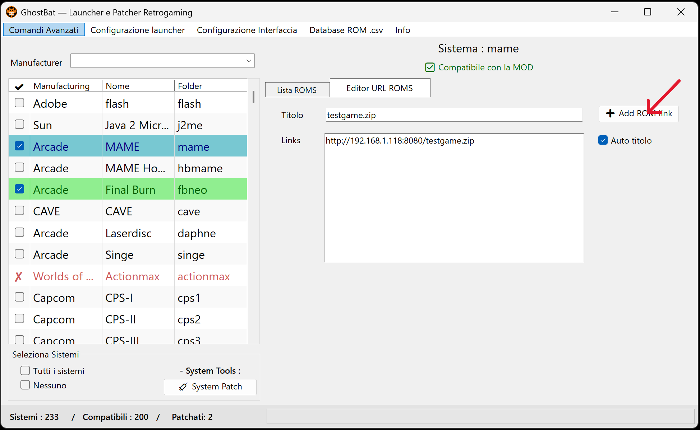

---

### 💿 Gestione ROM Multi-Disco e generazione M3U

Alcuni giochi retro, come quelli per **PlayStation 1**, sono distribuiti su più dischi (`CD1`, `CD2`, `CD3`, ecc.).  
GhostBat consente di unire questi dischi in un’unica ROM virtuale tramite un file `.m3u`, generabile direttamente dall’editor.

📌 Procedura:
1. Inserisci i link dei dischi nella lista CSV, usando file compatibili (`.chd`, `.iso`, `.bin`, ecc.)
2. Spunta nella lista i file che fanno parte dello stesso gioco
3. Clicca sul pulsante **“Genera Playlist .m3u”**

✅ GhostBat crea un file `.m3u` contenente i dischi selezionati e lo patcha automaticamente.  
Nel frontend RetroBat apparirà una sola voce (es. `CD1`), ma il launcher integrerà tutti i dischi per un’emulazione corretta.

⚠️ Importante:
- I giochi multi-disco **non vengono gestiti automaticamente** dalla funzione “Applica patch a tutti i sistemi”
- Se si applica la patch globale prima della generazione M3U, i dischi verranno trattati come giochi separati
- In tal caso è consigliabile:
  - Rimuovere quelle voci dal CSV
  - Reinserirle manualmente e generare la playlist `.m3u`

📣 Questa funzione è compatibile solo con i sistemi che supportano il formato multi-disco via M3U.

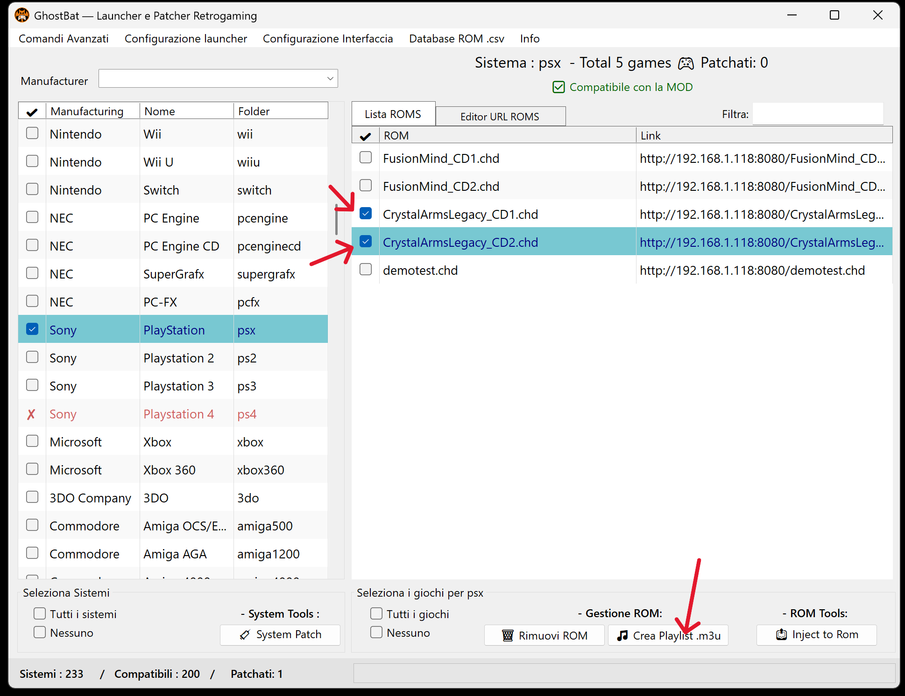

---

## 🧃 9. Selezione delle ROM e iniezione patch

Vai al tab **Lista ROMs** per visualizzare i titoli aggiunti.

✔️ Puoi:
- Selezionare tutte le ROM
- O patcharle in modo selettivo

Premi **Inject to ROM** per applicare i metadati.

📌 Le ROM patchate verranno evidenziate con **riga verde**, così come accade per i sistemi.

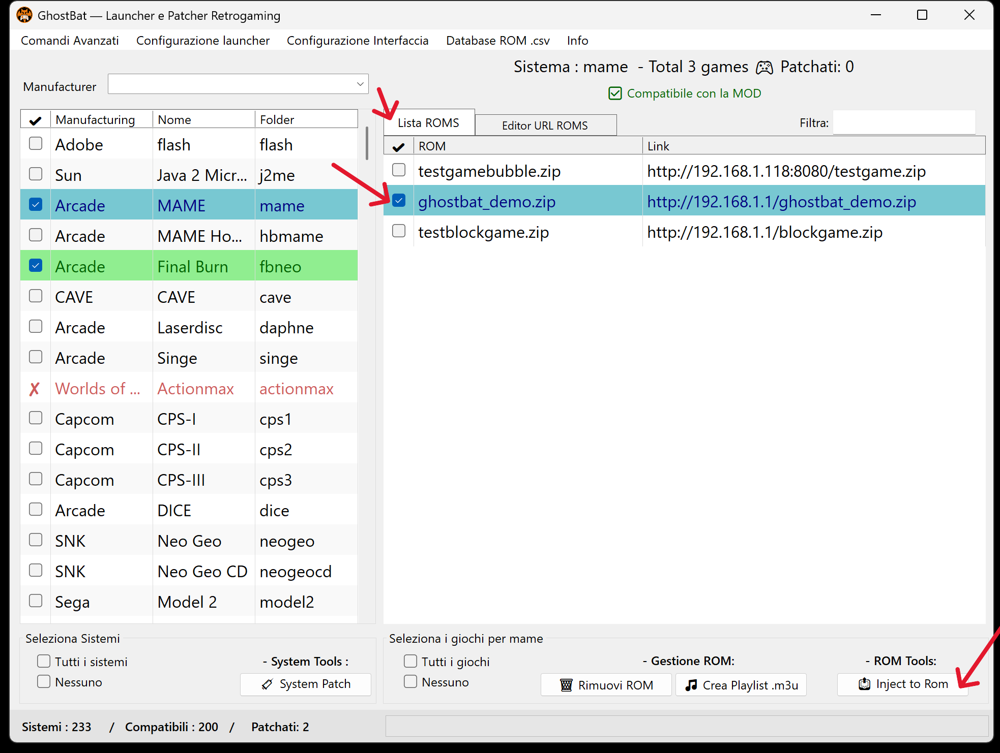

---

## ✅ 10. Conferma finale e generazione file patch

Al termine, GhostBat mostra un messaggio:

> Completato.  
> 1 file generati nella cartella 'roms'.

Questo conferma che la patch è stata salvata correttamente.

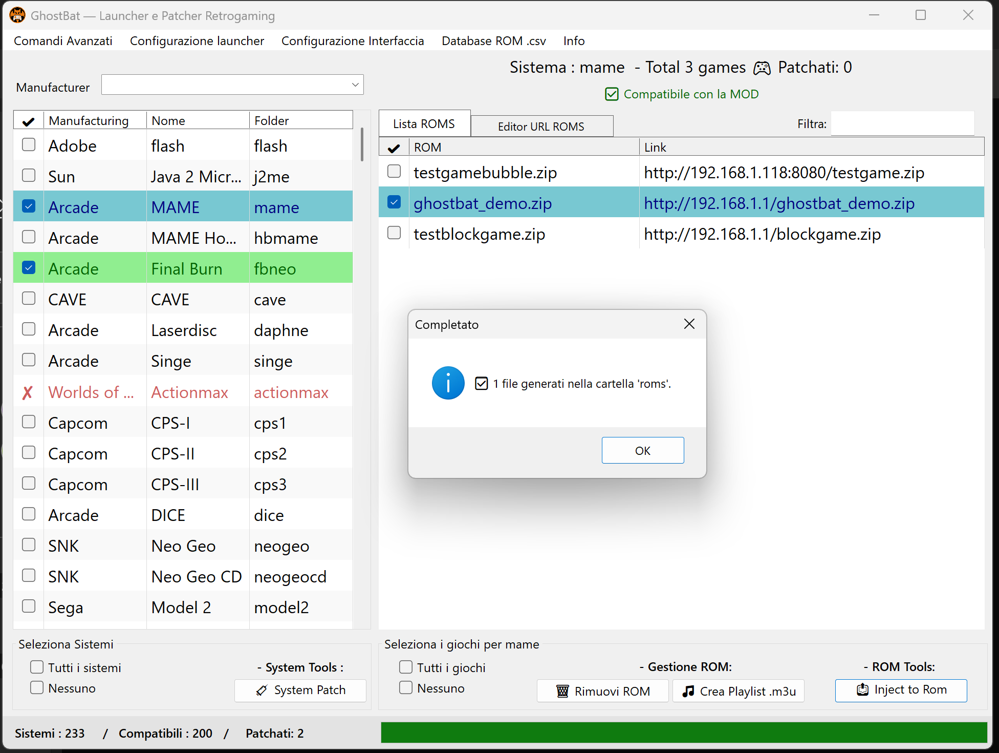

---

## 🗑️ Gestione della rimozione ROM — File Patch vs Voce CSV

GhostBat offre due modalità distinte per rimuovere selettivamente le ROM inserite.

---

### 🔥 Rimuovere i file patchati dalla cartella `roms/`

Questa funzione cancella fisicamente i file generati dopo l’iniezione della ROM.

✔️ Procedura:
- Spunta una o più ROM nella lista utilizzando le **checkbox**  
- Premi il tasto **“Rimuovi ROM”**

✅ Puoi rimuovere più file contemporaneamente  
📌 Le voci nel file `.csv` rimangono intatte e possono essere ripatchate in seguito

---

### 🧹 Rimuovere la voce dal database CSV

Questa azione elimina la riga corrispondente nel file `.csv`, ma **non** rimuove il file iniettato nella cartella `roms`.

✔️ Procedura:
- Clicca sulla **riga della ROM** (non la checkbox) per selezionarla  
- Premi il **tasto destro del mouse**  
- Seleziona **“Rimuovi da CSV”**

📌 Funziona **su una ROM alla volta**  
📦 Il file nella cartella `roms` non viene eliminato

---

🔁 Per rimuovere completamente una ROM (patch + voce CSV), esegui **entrambe le operazioni** in sequenza.

---

## 🛠️ Menu Funzioni Avanzate

GhostBat offre una serie di funzionalità extra accessibili dal menu principale.  
Queste opzioni non sono richieste per il flusso standard, ma possono risultare utili per utenti più esperti.

---

### 📂 Comandi Avanzati

- **Applica patch a tutti i sistemi e ROMs**  
  Applica automaticamente la patch su tutti i sistemi supportati e le ROM presenti nei file `.csv`.

- **Rimuovi mod definitivamente**  
  Rimuove:
  - Tutti i sistemi patchati
  - Le ROM iniettate
  - I file installati da GhostBat  
  📌 Ripristina RetroBat allo stato originale.

---

### ⚙️ Configurazione Launcher

- **Ricorda ultimo lancio** (ON/OFF)  
  Se attiva, evita di riscaricare la ROM se viene riavviata consecutivamente.  
  📌 Il programma salva lo stato dell’ultimo gioco avviato.

---

### 🎨 Configurazione Interfaccia

- **Modifica font delle tabelle ROM**  
  Permette di scegliere la dimensione del testo nelle liste da quella predefinita fino a `14`.

---

### 🗂️ Gestione Database CSV

- **Salva backup ZIP**  
  Archivia i file `.csv` in un unico file `.zip`.

- **Carica backup ZIP**  
  Ripristina i file `.csv` da un archivio `.zip` precedentemente salvato.

- **Svuota cartella CSV**  
  Elimina tutti i file `.csv` creati fino a quel momento.

- **Apri cartella CSV**  
  Apre la directory contenente tutti i file `.csv` generati.

---

### 📘 Info 

- **Leggi README**
- **Leggi Disclaimer**
- **Leggi License**

📌 I documenti sono disponibili in lingua italiana e inglese.  
GhostBat è interamente localizzato in italiano.

---

## ℹ️ Note tecniche

- Tutte le modifiche effettuate tramite GhostBat sono **temporanee e reversibili**
- Ogni sistema patchato genera un file `.csv` che contiene la lista dei link associati alle ROM
- A seguito dell’iniezione, GhostBat crea **file individuali nella cartella `roms`**, ognuno con lo **stesso nome della ROM selezionata**, e contenente al suo interno il link associato
- È possibile:
  - Aggiungere nuove ROM in qualsiasi momento
  - Rimuovere voci dal CSV
  - Ripetere la patch quando necessario

📌 I file `.csv` devono essere **creati esclusivamente tramite l’Editor interno di GhostBat**.  
L’utilizzo di CSV modificati esternamente può causare:
- Errori nella gestione multi-link
- Malfunzionamenti nel patcher
- Duplicazioni o conflitti tra file ROM

✅ L’Editor ufficiale gestisce correttamente:
- La sintassi interna e la struttura dei link
- La rimozione automatica dei file generati e dei doppioni
- L’integrazione con tutte le funzioni del launcher

🧠 Per una compatibilità sicura, **non esportare né editare manualmente i CSV**: usa sempre l’Editor integrato.

---

Grazie per aver scelto GhostBat! 💻  
Per supporto, visita il repository GitHub ufficiale o apri una issue nel tab “Issues”.
