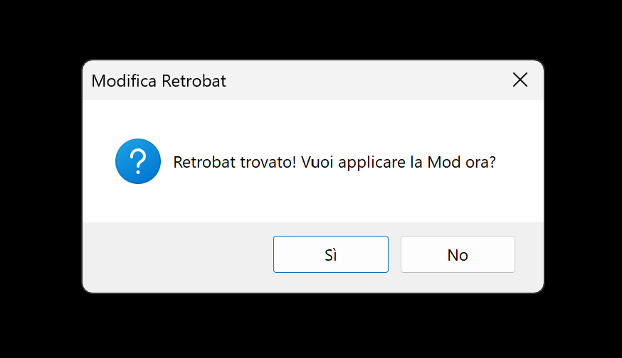
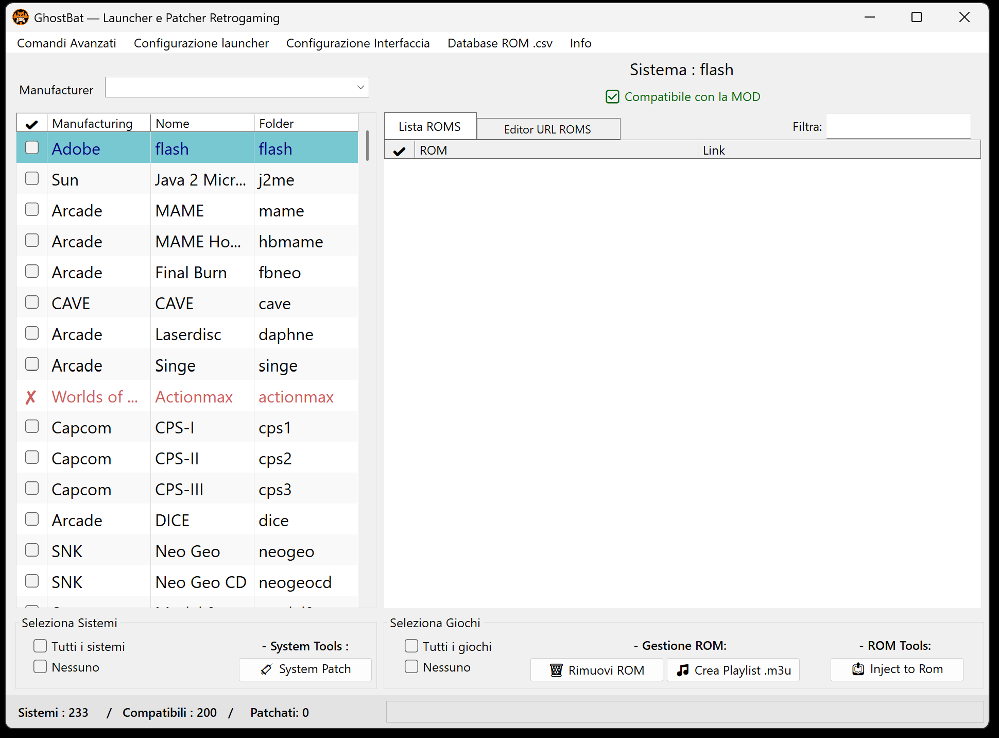
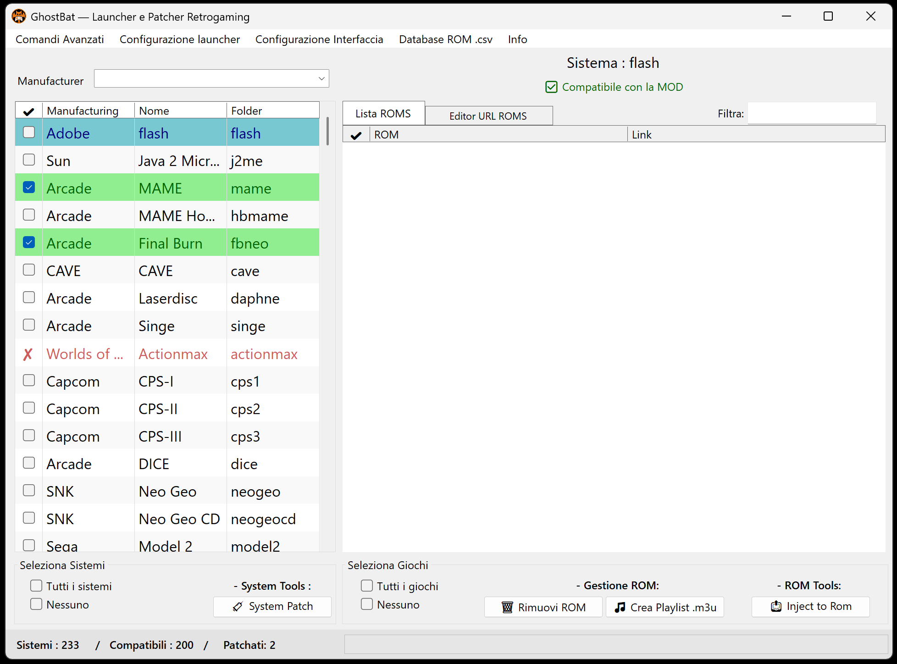
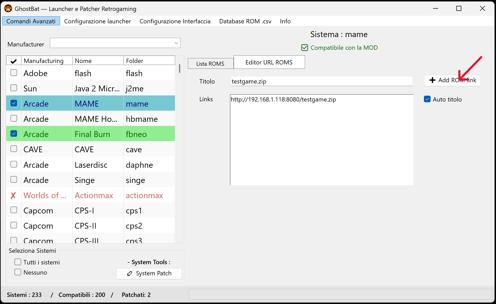

# 📘 GhostBat Usage Guide — Step-by-Step Tutorial

This guide describes the complete flow for using GhostBat as a selective patcher for RetroBat systems, via custom CSV files and direct ROM links.

---

## ⚠️ 1. Initial Disclaimer Prompt

When launching GhostBat, a disclaimer is shown about the reversible functionality of the program.  
The user must click **“Yes”** to proceed.

---

## 🔎 2. RetroBat Detection and Mod Application Request

After accepting the disclaimer, GhostBat automatically checks if RetroBat is present in the root of the drive.

📌 If detected successfully, this message appears:

> ✅ RetroBat found! Would you like to apply the mod?

Select **“Yes”** to begin patching.

---

## ✅ 3. Mod Confirmation Message

GhostBat applies the necessary mod and displays:

> Mod successfully installed! You can now select compatible systems.

---

## 🧩 4. Opening the Selective Patcher (`mod` folder)

The selective patcher located in the `mod` folder opens, allowing you to:

- View the list of compatible RetroBat systems  
- Select which systems to patch individually

---

## 🛠️ 5. Selecting Systems to Patch

✔️ You can:
- Check only the systems you want  
- Or select all

Click the **System Patch** button to apply changes.

---

## 🍃 6. Identifying Patched Systems

Successfully patched systems appear with a green row in the side list.  
This confirms they are active and ready for ROM injection.

---

## 🌐 7. Opening the ROM URL Editor

Select a patched system and click **Editor URL ROMS** to open the interface for inserting remote ROM links.

---

## 🌍 8. Inserting ROM Links and Adding to CSV

You can manually add ROM entries for the selected system.

📌 Provide:
- The **ROM file name** (e.g. `gamefile.extension`)  
- The **remote or local link** (e.g. `http://192.168.1.118:8080/gamefile.extension`)

✅ Click **Add ROM link** to insert each entry.  
Entries are saved automatically in the system's `.csv` file.

---

### 🔎 Technical Requirements

> Both the ROM name and the link must end with a valid file extension (e.g. `.zip`, `.7z`, `.bin`).  
> ⚠️ Without proper extensions, RetroBat may fail to recognize the files.

You can enable **Auto Title** to auto-generate the ROM name from the link.

---

### 📦 Handling Multi-File ROMs

Some systems require multiple files for a single game (e.g. MAME Naomi, Daphne).  
GhostBat lets you associate files added in sequence:

✔️ Add the main ROM file first  
✔️ Then add any `.chd`, scripts, or media files  
✔️ Use **Add ROM link** for each entry

GhostBat links them internally for correct launch behavior.

📣 No specific game examples are provided; users are expected to know their target system’s file structure.

---

### 💿 Multi-Disc ROMs and M3U Generation

GhostBat supports combining multi-disc games (e.g. PS1) into a `.m3u` playlist.

📌 Steps:
1. Add all disc links to the CSV  
2. Select them from the list  
3. Click **Generate Playlist .m3u**

✅ GhostBat creates the playlist and patches it correctly.  
RetroBat will display one unified entry, while the launcher loads all discs.

⚠️ Important:
- This feature is not supported by global patching  
- Manual re-entry is required to build proper `.m3u` links

---

## 🧃 9. ROM Selection and Patch Injection

Go to the **ROM List** tab to view added entries.

✔️ Select all or specific ROMs  
✔️ Click **Inject to ROM** to apply metadata

📌 Patched ROMs are marked with green rows.

---

## ✅ 10. Final Confirmation and Patch Generation

Once complete, GhostBat displays:

> Completed.  
> 1 file generated in the 'roms' folder.

This confirms successful patching.

---

## 🗑️ Managing ROM Removal — Patch Files vs CSV Entries

GhostBat provides two distinct methods for removing previously added ROMs:

---

### 🔥 Removing Injected Patch Files from the `roms/` Folder

This operation deletes the actual files that were created during the ROM injection process.

✔️ Steps:
- Use the **checkboxes** to select one or more ROM entries in the list  
- Click the **Remove ROM** button

✅ Multiple files can be removed at once  
📌 The corresponding entries in the `.csv` database remain intact and can be re-injected later

---

### 🧹 Removing Entries from the CSV Database

This removes the ROM entry from the `.csv` database but does **not** delete the injected patch file.

✔️ Steps:
- Click directly on the **ROM row** (not the checkbox) to select it  
- **Right-click** to open the context menu  
- Choose **Remove from CSV**

📌 This action works **on one entry at a time**  
📦 The patch file in the `roms/` folder remains untouched

---

🔁 To completely remove a ROM (both the patch and the CSV entry), perform **both actions** in sequence.

---

> 🧠 The CSV database acts as your personal ROM library:  
> you can store hundreds of entries, keep them organized, and selectively inject only the ones you want at any given time.  
> Even after deleting the patch file, the CSV entry remains available for future use.

---

## 🛠️ Advanced Menu Options

GhostBat offers extra features via the main menu.

---

### 📂 Advanced Commands

- **Patch all systems and ROMs**  
- **Remove mod permanently** (restores RetroBat to default)

---

### ⚙️ Launcher Configuration

- **Remember last launch** — prevents re-downloading if the same ROM is launched again

---

### 🎨 Interface Settings

- **Adjust ROM table font size** — up to 14pt

---

### 🗂️ CSV Management

- **Save backup ZIP** of all `.csv` files  
- **Restore from backup ZIP**  
- **Clear CSV folder**  
- **Open CSV folder**

---

### 📘 Info Panel

- **Read README**  
- **Read Disclaimer**  
- **Read License**

📌 Documentation available in Italian and English.  
GhostBat is fully localized in Italian.

---

## ℹ️ Technical Notes

- All changes are **temporary and reversible**  
- Every patched system creates a corresponding `.csv` file  
- ROM injections generate individual patch files inside the `roms` folder

You can:
- Add new ROMs anytime  
- Remove entries from the `.csv`  
- Repatch as needed

📌 Use GhostBat’s internal editor only to modify `.csv` files.  
External edits may cause:
- Multi-link errors  
- ROM conflicts or patch failures

✅ The internal editor guarantees:
- Safe structure and syntax  
- Automatic cleanup of duplicates  
- Compatibility with launcher logic

🧠 For consistent results, avoid manual `.csv` editing. Always use the GhostBat editor.

---

Thank you for using GhostBat! 💻  
For support, visit the GitHub repository or open an issue in the Issues tab.
